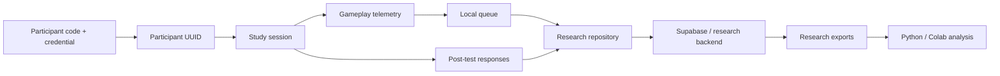
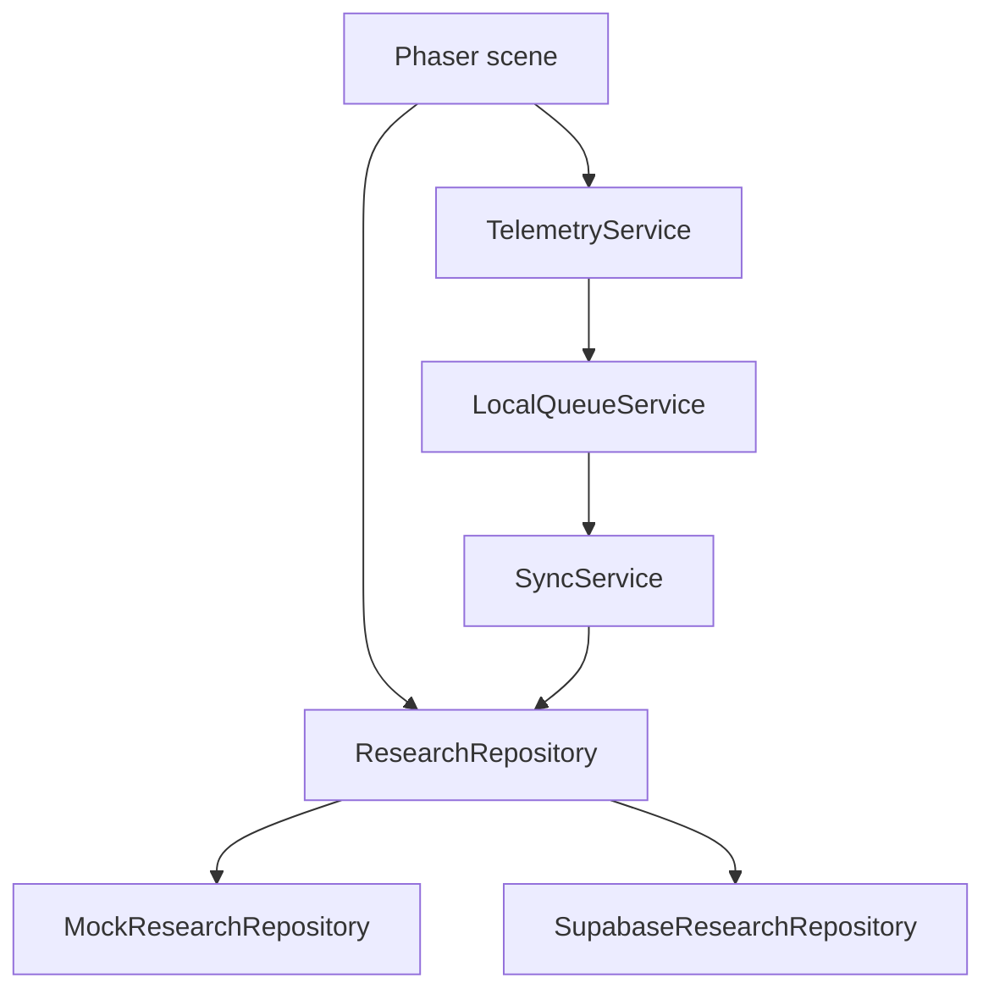

<div align="center">

# ApuLab Research

### Research instrumentation, data governance, and telemetry for ApuLab Station

**ApuLab Research is the open research layer behind the ApuLab Station web pilot. It defines how participant sessions, gameplay events, post-test responses, privacy controls, synchronization, and research-ready data are modeled and validated.**

[](docs/DATA_GOVERNANCE.md)
[](https://www.typescriptlang.org/)
[](https://phaser.io/)
[](https://threejs.org/)
[](OPEN_SOURCE.md)

</div>

---

## Overview

ApuLab Research provides the research-oriented architecture used to instrument ApuLab Station while keeping gameplay code separated from persistence and study infrastructure.

The repository focuses on five responsibilities:

- pseudonymous participant and session modeling;
- append-only behavioral telemetry;
- controlled study and demo separation;
- post-test linkage and research exports;
- privacy, governance, validation, and offline-safe synchronization.

The web-pilot runtime is built with **Phaser 4.2.1, TypeScript, Vite, and an optional Three.js visual overlay**. Research persistence is abstracted behind a repository contract so gameplay scenes do not call databases directly.

## Research model



## What is collected

The research schema is designed around behavioral interaction data rather than direct personal information.

| Area | Examples |
| --- | --- |
| **Session** | mode, version, timestamps, completion state, checkpoint |
| **Gameplay** | event type, attempt number, result, duration, hint usage |
| **Interaction** | choices, measurements, configuration changes, challenge outcomes |
| **Post-test** | questionnaire version, question ID, structured answer |
| **Operations** | sync success/failure, retry state, backend receipt time |

The canonical field-level specification is maintained in [`docs/DATA_DICTIONARY.md`](docs/DATA_DICTIONARY.md).

## Privacy by design

The governance model prohibits direct identifiers and high-risk payloads in research telemetry.

The research pipeline must not store names, email addresses, phone numbers, identity documents, exact birth dates, geolocation, school names, social profiles, photographs, audio, video, screenshots, raw credentials, full HTML, or unrestricted application dumps.

Participant codes and credentials are intended to be represented using protected hashes in the research backend. The ordinary analysis dataset excludes credentials, secrets, and administrative fields.

See [`docs/DATA_GOVERNANCE.md`](docs/DATA_GOVERNANCE.md).

## Study and demo separation

ApuLab distinguishes between:

- **STUDY** sessions: associated with a pseudonymous participant UUID and eligible for official research analysis;
- **DEMO** sessions: not associated with a participant UUID and excluded from the official study dataset.

This separation is part of the data contract, not just a UI convention.

## Telemetry architecture

Gameplay scenes do not write directly to Supabase or SQL.



This design keeps research persistence replaceable, supports local development, and reduces coupling between gameplay and backend infrastructure.

## Event catalog

Research events are intentionally selective. High-frequency noise such as mouse movement, frames, pixels, hover events, and animation tweens should not be collected.

The catalog covers session start, checkpoints, challenge attempts, relevant choices, measurements, answers, hints, configuration changes, post-test lifecycle, final completion, and synchronization outcomes.

See [`docs/EVENT_CATALOG.md`](docs/EVENT_CATALOG.md).

## Offline-first behavior

Telemetry is queued locally before synchronization. Events are only treated as synchronized after backend confirmation.

```text
pending -> syncing -> synced
               \-> failed / retry
```

Idempotent event IDs prevent duplicate logical rows when a batch is retried.

## Research documentation

| Document | Purpose |
| --- | --- |
| [`ARCHITECTURE.md`](docs/ARCHITECTURE.md) | Runtime and research-system boundaries |
| [`DATA_GOVERNANCE.md`](docs/DATA_GOVERNANCE.md) | Privacy, security, retention, and study rules |
| [`DATA_DICTIONARY.md`](docs/DATA_DICTIONARY.md) | Canonical research fields |
| [`EVENT_CATALOG.md`](docs/EVENT_CATALOG.md) | Allowed research event types and payloads |
| [`DATA_TEST_PLAN.md`](docs/DATA_TEST_PLAN.md) | Validation and failure-mode checks |
| [`SCENE_MAP.md`](docs/SCENE_MAP.md) | Scene-level project map |
| [`FUTURE_IMPLEMENTATION.md`](docs/FUTURE_IMPLEMENTATION.md) | Deferred integrations and future work |

## Technology stack

| Layer | Technology |
| --- | --- |
| Runtime | Phaser 4.2.1 |
| 3D overlay | Three.js 0.185+ |
| Language | TypeScript |
| Build | Vite |
| Local research mode | MockResearchRepository |
| Research adapter | SupabaseResearchRepository |
| Analysis target | CSV / Python / Google Colab |

Current package version: **0.1.0-web-pilot**.

## Local development

### Install

```bash
npm install
```

### Run

```bash
npm run dev
```

### Build

```bash
npm run build
```

### Preview

```bash
npm run preview
```

By default, development should use mock research persistence unless a validated research backend is explicitly configured.

## Research integrity principles

1. Gameplay scenes do not directly access research databases.
2. Study and demo records remain distinguishable.
3. Research events are append-only.
4. Direct personal information is excluded.
5. Payloads remain small and analysis-oriented.
6. Retries must be idempotent.
7. Credentials never become research variables.
8. Exports exclude secrets and administrative-only fields.

## Open source

Source code is released under the **MIT License**.

Original documentation and original project content may be reused under **CC BY 4.0**, subject to attribution and the exclusions described in [`CONTENT-LICENSE.md`](CONTENT-LICENSE.md). Third-party assets and dependencies retain their original licenses.

See [`OPEN_SOURCE.md`](OPEN_SOURCE.md) for the repository-wide policy.

## Contributing

Contributions are welcome, especially around research instrumentation, privacy-preserving telemetry, validation, documentation, and reproducible analysis.

Before contributing, read [`CONTRIBUTING.md`](CONTRIBUTING.md). Any new research field or event type must also update the relevant governance, dictionary, and event-catalog documents.

---

<div align="center">

**ApuLab Research · Observe behavior, protect participants, preserve research integrity**

</div>
