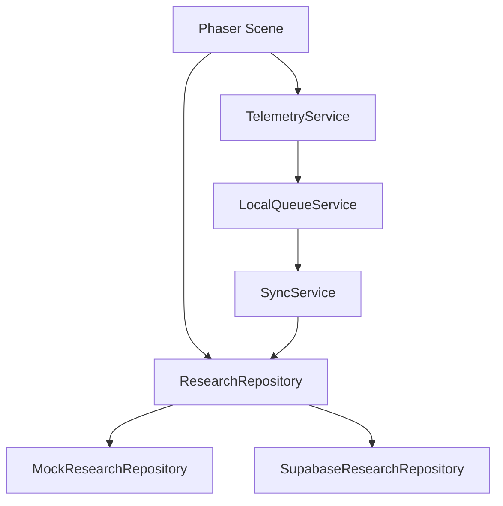

# ApuLab Station Architecture

Este documento resume la arquitectura vigente para que nuevos agentes no conecten integraciones futuras directamente dentro de escenas.

## Runtime

ApuLab usa Phaser 4.2.1, TypeScript y Vite. Las escenas viven en `src/game/scenes/`. Phaser Editor 5 puede editar layouts visuales, mientras la logica funcional permanece en TypeScript.

## Scene Responsibilities

Las escenas controlan presentacion, interaccion y navegacion. No deben llamar Supabase, SQL, SDKs de base de datos ni `fetch` directo para persistencia de investigacion.

## Data Flow

`VITE_DATA_MODE=mock` es el modo por defecto de desarrollo. `VITE_DATA_MODE=supabase` solo debe usarse cuando Supabase Research este configurado y validado.

## Research Repository

`ResearchRepository` es el contrato estable para autenticacion, sesiones, eventos, POST, finalizacion y checkpoints. Las implementaciones actuales son:

- `MockResearchRepository`: desarrollo local, DEMO, Phaser Editor.
- `SupabaseResearchRepository`: adaptador previsto para investigacion real mediante Edge Functions.

## Research vs Impact

Research contiene datos de estudio y no debe alimentar dashboards publicos directamente. Impact sera una capa futura de metricas anonimas/agregadas.

## Master Documents

- `DESIGN.md`: direccion visual.
- `docs/ARCHITECTURE.md`: arquitectura tecnica.
- `docs/SCENE_MAP.md`: escenas y dependencias.
- `docs/DATA_GOVERNANCE.md`: proteccion y manejo de datos.
- `docs/FUTURE_IMPLEMENTATION.md`: integraciones aplazadas.
