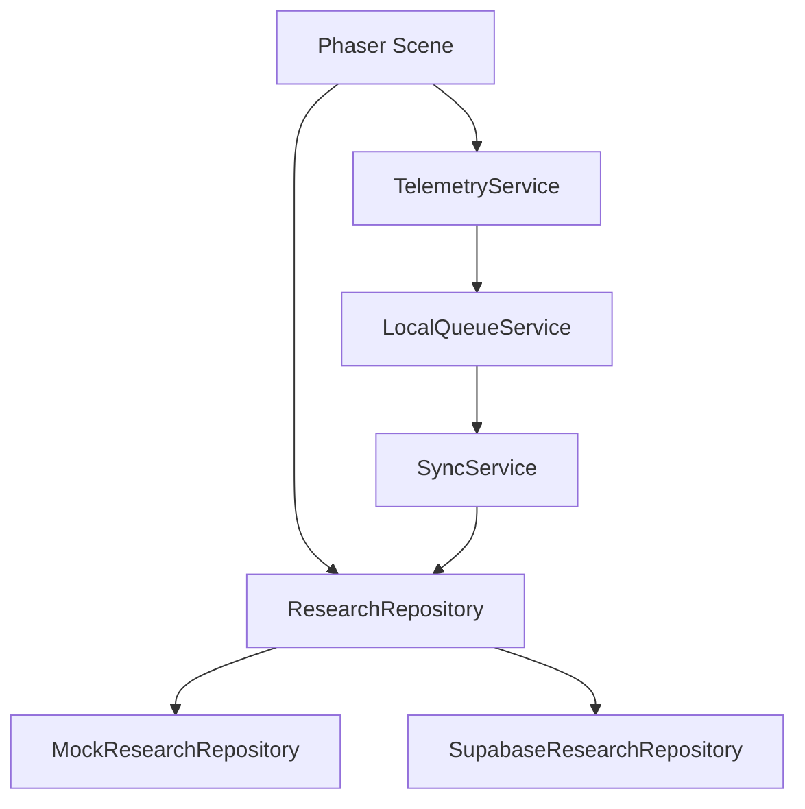

# ApuLab Station Architecture

Este documento resume la arquitectura vigente para que nuevos agentes no conecten integraciones futuras directamente dentro de escenas.

## Runtime

ApuLab usa Phaser 4.2.1, TypeScript y Vite. Las escenas viven en `src/game/scenes/`. Phaser Editor 5 puede editar layouts visuales, mientras la logica funcional permanece en TypeScript.

## Scene Responsibilities

Las escenas controlan presentacion, interaccion y navegacion. No deben llamar Supabase, SQL, SDKs de base de datos ni `fetch` directo para persistencia de investigacion.

## Visual 3D Layer

Phaser sigue siendo el motor principal de gameplay, UI, navegacion y telemetria. Three.js se usa solo como capa visual superpuesta para assets 3D low-poly en escenas que lo necesiten, empezando por `Level1RoverHubScene`.

`src/game/three/ThreeOverlay.ts` crea un canvas WebGL transparente dentro de `#game-container`, con `pointer-events: none`, resize propio y cleanup completo al cerrar la escena. Los modelos GLB del Hub Level 1 se cargan directamente desde `public/assets/level1/shared/models/` mediante `GLTFLoader`; no forman parte del Asset Pack de Phaser.

## Data Flow

`VITE_DATA_MODE=mock` es el modo por defecto de desarrollo. `VITE_DATA_MODE=supabase` solo debe usarse cuando Supabase Research este configurado y validado.

Game progress is runtime-only and is not restored after page reload or browser/tab closure. `GameState` keeps playable session data in memory for scene-to-scene navigation during the current execution only. Telemetry queues and research/mock repository storage are separate data flows and may continue using local or backend persistence.

## Research Repository

`ResearchRepository` es el contrato estable para autenticacion, sesiones, eventos, POST, finalizacion y checkpoints. Las implementaciones actuales son:

- `MockResearchRepository`: desarrollo local, DEMO, Phaser Editor.
- `SupabaseResearchRepository`: adaptador previsto para investigacion real mediante Edge Functions.

## Research vs Impact

Research contiene datos de estudio y no debe alimentar dashboards publicos directamente. Impact sera una capa futura de metricas anonimas/agregadas.

## Master Documents

- `DESIGN.md`: direccion visual.
- `docs/ARCHITECTURE.md`: arquitectura tecnica.
- `docs/SCENE_MAP.md`: escenas y dependencias.
- `docs/DATA_GOVERNANCE.md`: proteccion y manejo de datos.
- `docs/FUTURE_IMPLEMENTATION.md`: integraciones aplazadas.
