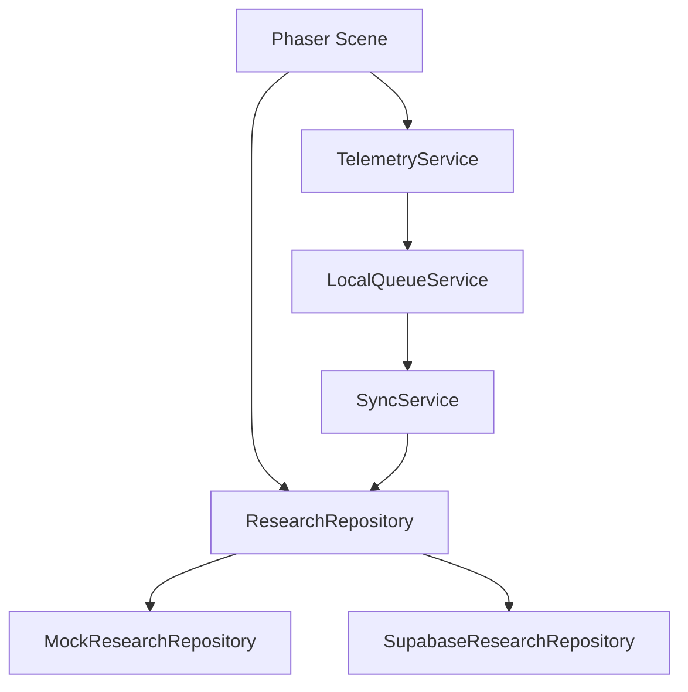

# ApuLab Station Architecture

This document summarizes the current architecture so future agents and contributors do not connect external integrations directly inside gameplay scenes.

## Runtime

ApuLab uses Phaser 4.2.1, TypeScript, and Vite. Scenes live in `src/game/scenes/`. Phaser Editor 5 may be used to edit visual layouts, while functional logic remains in TypeScript.

## Scene responsibilities

Scenes control presentation, interaction, and navigation. They must not call Supabase, SQL, database SDKs, or direct persistence-oriented `fetch` requests for research data.

## Visual 3D layer

Phaser remains the primary engine for gameplay, UI, navigation, and telemetry. Three.js is used only as an overlaid visual layer for low-poly 3D assets in scenes that require it, beginning with `Level1RoverHubScene`.

`src/game/three/ThreeOverlay.ts` creates a transparent WebGL canvas inside `#game-container`, with `pointer-events: none`, its own resize handling, and complete cleanup when the scene closes. GLB models used by the Level 1 Hub are loaded directly from `public/assets/level1/shared/models/` through `GLTFLoader`; they are not part of the Phaser Asset Pack.

## Data flow

`VITE_DATA_MODE=mock` is the default development mode. `VITE_DATA_MODE=supabase` should only be used when the Supabase research environment is configured and validated.

Game progress is runtime-only and is not restored after a page reload or browser/tab closure. `GameState` keeps playable-session data in memory for scene-to-scene navigation during the current execution only. Telemetry queues and research/mock repository storage are separate data flows and may continue using local or backend persistence.

## Research repository

`ResearchRepository` is the stable contract for authentication, sessions, events, post-test data, completion, and checkpoints.

Current implementations:

- `MockResearchRepository`: local development, demo mode, and Phaser Editor.
- `SupabaseResearchRepository`: adapter intended for real research persistence through Edge Functions.

## Research vs. impact

The research layer contains study data and must not feed public dashboards directly. A future impact layer may expose only anonymous and aggregated metrics.

## Master documents

- `README.md`: public project overview.
- `DESIGN.md`: visual direction.
- `docs/ARCHITECTURE.md`: technical architecture.
- `docs/SCENE_MAP.md`: scenes and dependencies.
- `docs/DATA_GOVERNANCE.md`: research-data protection and handling.
- `docs/DATA_DICTIONARY.md`: canonical field definitions.
- `docs/EVENT_CATALOG.md`: allowed telemetry events.
- `docs/DATA_TEST_PLAN.md`: research-data validation.
- `docs/FUTURE_IMPLEMENTATION.md`: deferred integrations.
