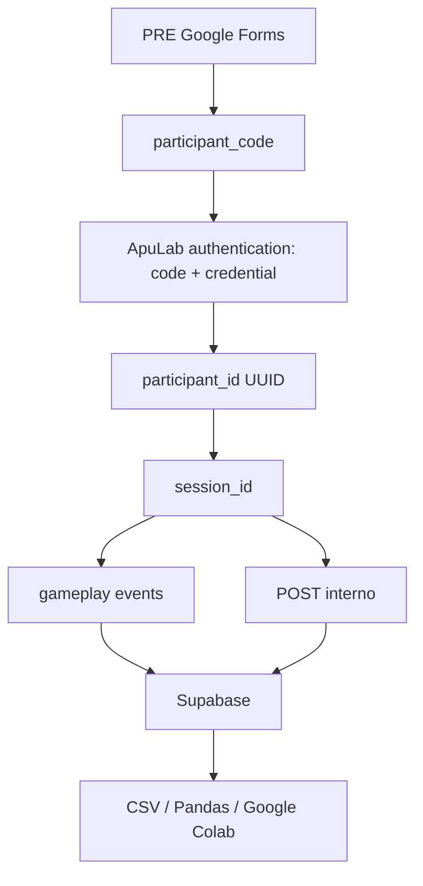

# ApuLab Station Data Governance

Este documento es la fuente oficial para manejo de datos de investigacion de ApuLab Station. Ningun nivel, reto o agente debe inventar campos, tablas o `event_type` sin actualizar este documento, `docs/DATA_DICTIONARY.md` y `docs/EVENT_CATALOG.md`.

## Finalidad

ApuLab almacena datos para evaluar aprendizaje y comportamiento de resolucion de problemas STEM en un piloto de aproximadamente 50 participantes. La base de datos no debe recopilar informacion personal directa.

## Datos Prohibidos

No almacenar nombres, apellidos, email, telefono, direccion, documento de identidad, fecha exacta de nacimiento, geolocalizacion, colegio, redes sociales, fotografias, audio, video, screenshots, HTML completo, logs enormes, stack traces completos ni credenciales en texto plano.

## Flujo Oficial

## Pseudonimizacion

El identificador humano entregado a cada nina es `participant_code`. El identificador interno principal es `participant_id UUID`. La tabla `apulab_participants` almacena `participant_code_hash`, no el codigo crudo, y `credential_hash`, no la credencial original.

El PRE en Google Forms usa solo `participant_code`. Para analisis posterior se debe unir mediante un procedimiento controlado: generar el mismo hash del codigo del PRE o usar un codebook protegido fuera de ApuLab. El dataset analitico ordinario no debe incluir credenciales ni secretos.

## Credencial

Cada participante tiene una credencial individual unica. La credencial solo evita accesos cruzados dentro de ApuLab; no es variable de investigacion. No aparece en Google Forms, telemetria, POST, CSV analitico, Colab ni reportes.

Los errores de autenticacion deben ser genericos: "El codigo o la contrasena no son correctos." No revelar si existe el codigo.

Estado de implementacion: esta tarea establece schema, migracion, Edge Function y reglas. El flujo cliente actual todavia debe conectarse en una fase posterior a la autenticacion `participant_code + credential` para obtener `participant_id` antes de iniciar sesiones STUDY en produccion.

## Modos de Datos

El frontend selecciona persistencia mediante `VITE_DATA_MODE`.

`VITE_DATA_MODE=mock` es el modo por defecto para desarrollo, demo, Phaser Editor y pruebas locales. Usa `MockResearchRepository`, guarda datos en `localStorage`, marca los registros con `environment = development` y no envia datos a Supabase. En este modo esta prohibido crear sesiones `study`; el flujo debe mostrar un error administrativo y permitir solo DEMO.

`VITE_DATA_MODE=supabase` usa `SupabaseResearchRepository` y la Edge Function configurada en `VITE_SUPABASE_INGEST_URL`. Este modo es el unico que puede crear sesiones `study`, y solo despues de autenticar `participant_code + credential` para obtener `participant_id`. El frontend nunca debe contener credenciales reales, hashes, `service_role` ni secretos administrativos.

Las escenas no deben llamar `SupabaseClient`, `fetch`, SQL ni SDKs de base de datos directamente. Deben hablar con servicios del juego y esos servicios deben persistir a traves de `ResearchRepository`.

## Rate Limiting

Politica inicial: maximo 5 intentos incorrectos consecutivos; luego espera temporal. No bloquear permanentemente. La tabla `apulab_auth_attempts` registra intentos pseudonimos para aplicar cooldown sin almacenar codigo o credencial crudos.

## Tablas Principales

- `apulab_participants`: participantes pseudonimas.
- `apulab_auth_attempts`: intentos para rate limiting.
- `apulab_sessions`: sesiones study/demo.
- `apulab_events`: telemetria append-only.
- `apulab_posttest_responses`: POST interno estructurado.

## STUDY vs DEMO

`session_mode = 'study'` requiere `participant_id`. Entra al dataset experimental.

`session_mode = 'demo'` requiere `participant_id IS NULL`. Se usa para jurados, docentes, equipo, presentaciones y desarrollo. Todo analisis oficial debe filtrar `session_mode = 'study'`.

## PRE

El PRE permanece en Google Forms. Google Forms no solicita credencial. No implementar PRE dentro de ApuLab en esta fase.

## POST

El POST es interno. Despues del gameplay no se vuelve a pedir codigo ni contrasena. ApuLab ya conoce `participant_id` y `session_id`, por lo que `apulab_posttest_responses` vincula respuestas automaticamente.

## Eventos

Los eventos de investigacion son append-only. No editar ni eliminar eventos historicos para corregir datos. Crear un evento nuevo para una nueva accion o correccion.

No registrar `mousemove`, frames, pixeles, hovers, tweens ni cambios visuales irrelevantes.

## Payload

Payload maximo conceptual: pequeno, estructurado y orientado a analisis. La migracion inicial limita `apulab_events.payload` a 8192 bytes y `apulab_posttest_responses.answer` a 4096 bytes.

Payload permitido: intento, eleccion, resultado, duracion, error, correccion, cantidad de cambios, secuencia usada, bloques usados, respuesta.

Payload prohibido: screenshots, imagenes, audio, video, estado completo Phaser, HTML, logs enormes, stack traces completos, credenciales y PII.

## Idempotencia

`event_id` es unico. El mismo evento reenviado varias veces debe producir una sola fila logica. La Edge Function debe hacer upsert/insert idempotente por `event_id`.

## Offline, Retries y Batching

La telemetria se guarda primero en `LocalQueueService`. Estados conceptuales: `pending`, `syncing`, `synced`, `failed/retry`. Un evento solo se elimina o se considera sincronizado despues de confirmacion del backend.

Usar backoff razonable y evitar loops agresivos. Enviar batches de aproximadamente 10-20 eventos, y sincronizar en checkpoints: `challenge_completed`, `posttest_completed`, `game_completed`, `visibilitychange/pagehide` cuando sea seguro.

## Finalizacion

Flujo final:

1. Challenge 3C completed.
2. Sync de eventos pendientes.
3. POST interno.
4. Sync POST.
5. `posttest_completed`.
6. `game_completed`.
7. Sync final.

Si falla Internet, usar `completed_pending_sync` hasta confirmar sincronizacion.

## Timestamps

Guardar `client_timestamp` y `received_at`. El primero indica cuando el cliente cree que ocurrio la accion; el segundo lo asigna backend/Supabase.

## Versionado

Cada sesion debe registrar `game_version` y `schema_version`. El POST debe registrar `questionnaire_version`.

## Seguridad y RLS

El frontend nunca debe contener `service_role` ni secretos administrativos. Solo puede conocer URLs/keys apropiadas para frontend. Operaciones privilegiadas deben ocurrir en Edge Functions.

RLS queda habilitado en tablas de investigacion. No crear politicas amplias para `anon`. La Edge Function usa privilegios de servidor para operaciones validadas.

La ruta `/authenticate` de la Edge Function existe como contrato seguro y falla cerrada con `participant_auth_not_configured` hasta implementar el verificador server-side de hashes/credenciales. No crear autenticacion falsa en el frontend para desbloquear STUDY.

## Capacidad Supabase Free

Antes de una campana se deben revisar limites reales vigentes de Supabase. Politica operativa inicial:

- 0-60%: NORMAL.
- 60-75%: WARNING.
- 75-85%: REVIEW.
- 85-90%: CRITICAL.
- >90%: no iniciar nuevas sesiones STUDY hasta resolver capacidad.

No esperar al 100%. No bloquear a una participante que ya esta jugando solo por alcanzar un threshold; la cola local protege eventos.

## Monitoreo

Queries simples deben permitir calcular participantes, sesiones study/demo, activas, completas, pendientes, eventos totales, POST completos y tamano aproximado del dataset. Las vistas `apulab_*_analysis` son la base para Colab.

## Backups

- Antes del piloto: backup.
- Antes de jornada de investigacion: verificacion del sistema.
- Despues de cada jornada relevante: exportacion/backup.

No borrar datos crudos durante el estudio para liberar espacio sin exportar, verificar y respaldar.

## Exportacion a Python / Colab

Exportar desde:

- `apulab_participants_analysis`
- `apulab_sessions_analysis`
- `apulab_events_analysis`
- `apulab_posttest_analysis`

No exportar `credential_hash`, secretos ni datos administrativos. El PRE se une posteriormente desde Google Forms mediante `participant_code` bajo procedimiento controlado.

## Procedimiento ante Fallas

Si falla Internet: continuar local, no marcar sincronizado, reintentar con backoff. Si falla Supabase: pausar nuevas sesiones study si la capacidad/riesgo lo requiere, conservar colas locales, exportar logs tecnicos no sensibles y no borrar datos.
